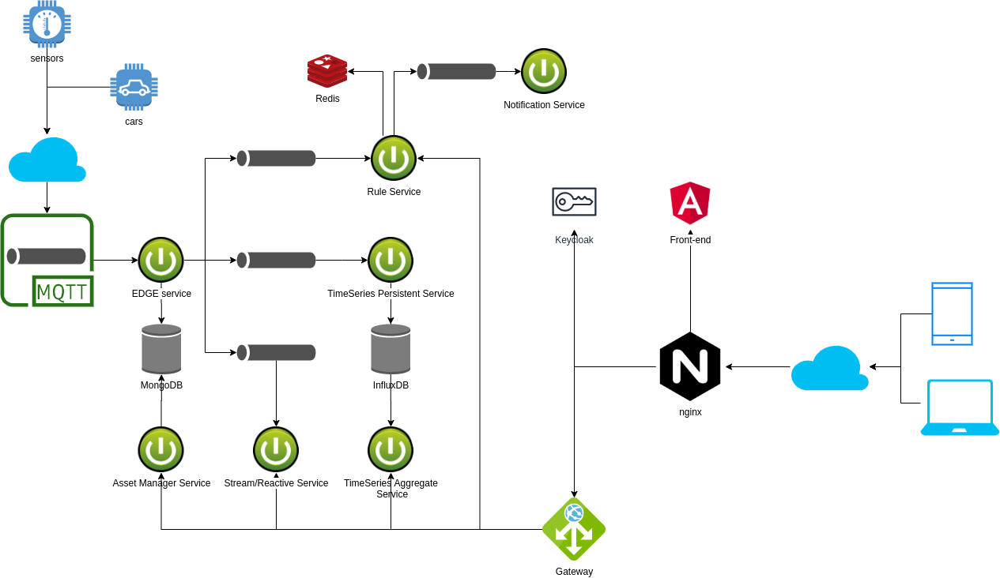

# How to System will Work

## Big Picture



## Edge Service

This service is responsible for recieve the information incoming across the devices, the service use the
**mqtt** protocol to recive messages, the format of the message MUST be JSON, with the following minimum payload:

```json
{
    "id": "2", 
    "tenantId": "1", 
    "token": "321", 
    "timestamp": 123213123, 
    ... custom fields
    "temperature": 27.3, 
    "memory": 36.3
}
```

#### Important
 - id, tenantId, and tokenId: must be used the supplied by **Asset Service**
 - timestamp: in seconds
 - custom fields: you can send any data to server, the edge service will intepretate it

## Asset Service

This service is responsible for maintain the Assets of system(Sensor), each sensor MUST have one Asset, the asset have
the token, id and tenant to be possible to send data to **Edge Service**

## Times Series Aggregation Service

This service is responsible for query the data sent to **Edge Service** and processed by **Time Series Persistent Service**, the API implementation of the service is very customizable and main endpoint is:

### GET /sensorData/{tenantId}/{sensorId}

The additional parameters are:

 - from: start date to query the timeseries, format MUST be Zulu Time or using the keyword **now()**
 - to: end date to query the timeseries, format MUST be Zulu Time or using the keyword **now()** 
 - selectCriteria: criteria select to query, group functions can be used(mean, man, min, etc)
 - intervalValue: group by interval value
 - intervalUnit: group by interval unit, must be S,H,D,M
 


## Times Series Persistent Service

This service is responsible for the persistence of the incoming data from **Edge Service**


## Rule Service


# Requirements to System

You will need to have pre installed:
 - JDK 8
 - maven
 - docker
 - docker-compose
 
# Developer start up

Clone the **iot-infra** and the execute the shell script **clone**:

```sh
$ chmod +x clone && ./clone
```

This command will create a folder in your home with all repos to development:

```sh
$ cd ~/iot-dev
```

Now you can start you favorite IDE and edit the code

# Runing the development environment

```sh
$ cd ~/iot-dev/iot-infra && docker-compose -f docker-compose-dev.yml up -d --build
```
 
 
